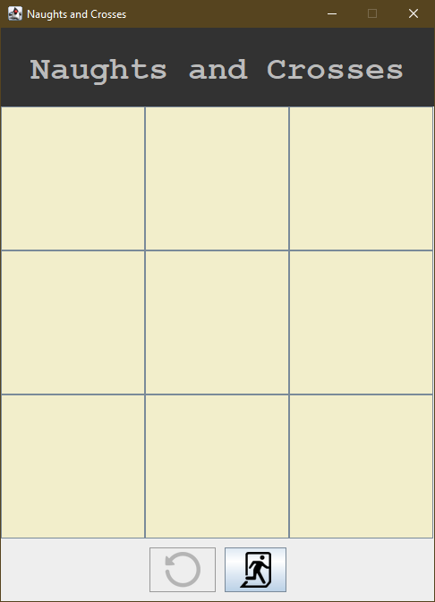

# NaughtsAndCrosses (Tic Tac Toe)

## Overview
NaughtsAndCrosses is a classic Tic Tac Toe game reimagined with a modern Java GUI interface. Developed as a personal project, this application is not just a fun game to play but also serves as a platform for advancing my Java programming skills, exploring new algorithms, and enhancing creativity through aesthetically pleasing visual design.

## Screenshots

### Empty Board

Here's what the game looks like at the start. An empty board ready for X and O to battle it out!

### X's Turn

This screenshot shows the board during X's turn. Notice the strategic placement aiming for a win.

### O Wins!

Congratulations to O! This screenshot captures the moment of victory for O, completing a line diagonally.

## Features
- **Interactive Gameplay**: Players can click on any grid to place their symbol (X or O), aiming to match three in a row.
- **Win Detection**: The game automatically detects and announces a winner if three symbols align horizontally, vertically, or diagonally.
- **Visual Appeal**: Utilizes Java’s color libraries to create a visually engaging interface that enhances the gaming experience.
- **Reset Function**: Players can start a new game anytime with a simple reset button.

## Learning Outcomes
The development of NaughtsAndCrosses provided me with valuable insights and skills in several key areas:
- **UI Interaction**: Learned how to update button text dynamically in response to user interactions, reflecting immediate changes in the game’s UI.
- **Logical Thinking**: Enhanced my algorithmic skills by implementing logic to detect various win conditions effectively.
- **Aesthetic Design**: Gained experience in using Java’s color libraries to design a visually pleasing user interface that enhances the playability and look of the game.

## Getting Started
To try out NaughtsAndCrosses on your local machine, follow these simple steps:

### Prerequisites
- Ensure you have Java JDK 11 or higher installed on your machine.
- Download or clone the repository to your local environment.

### Running the Game
1. Navigate to the directory where you have the project files.
2. Compile the Java files using your preferred IDE or the Java compiler via the command line.
3. Run the main application file to start the game.
